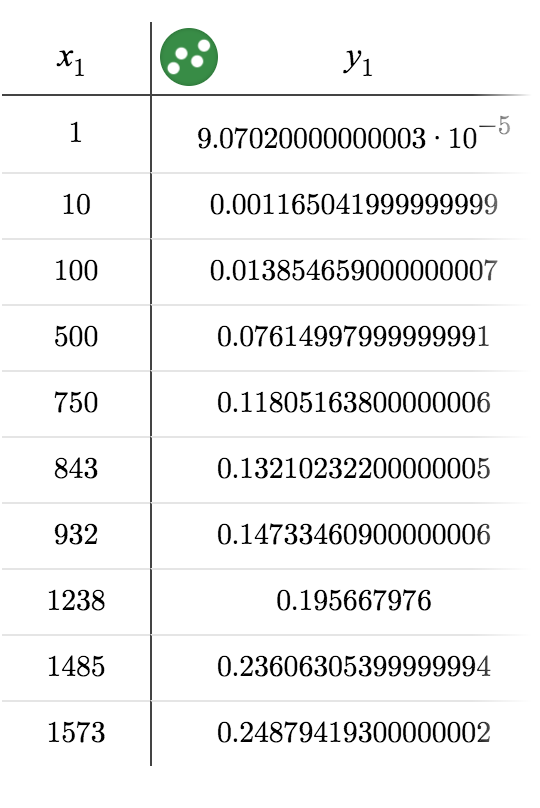
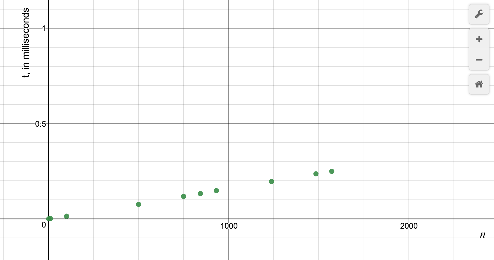
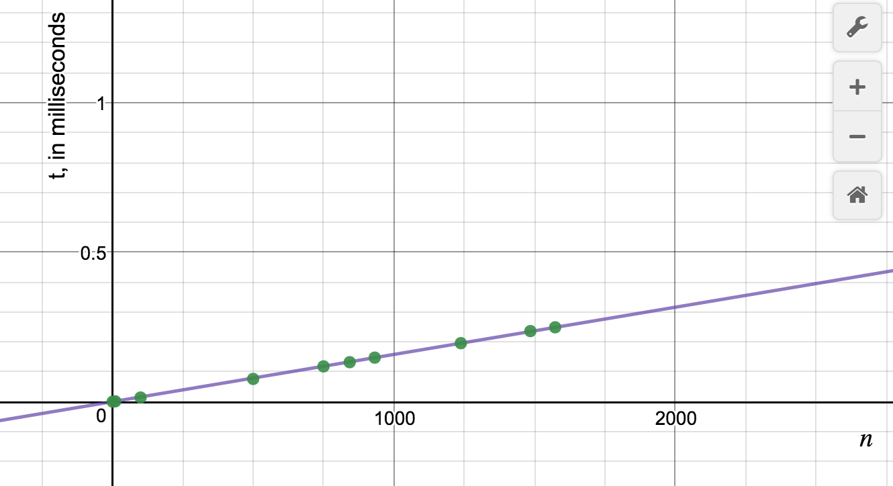
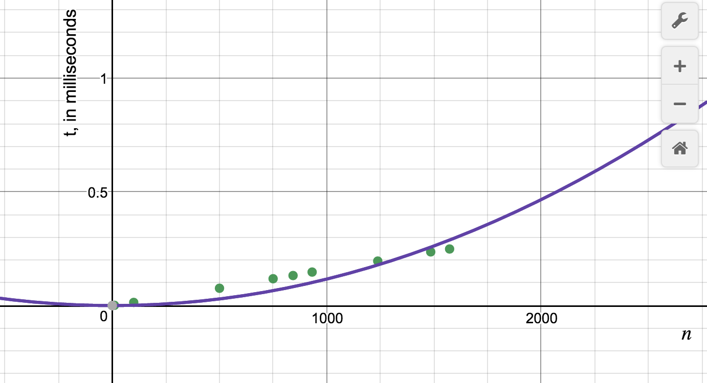
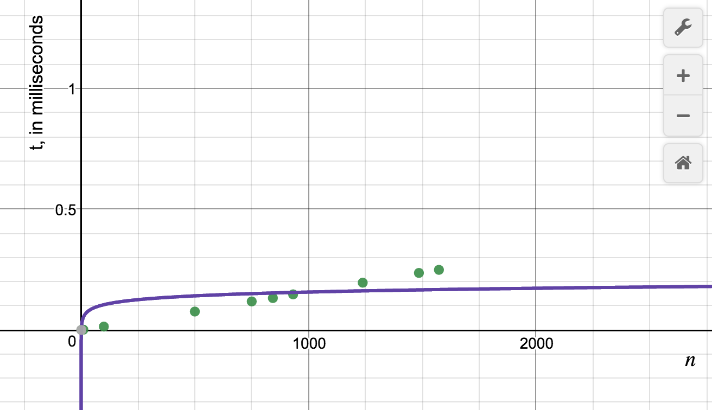
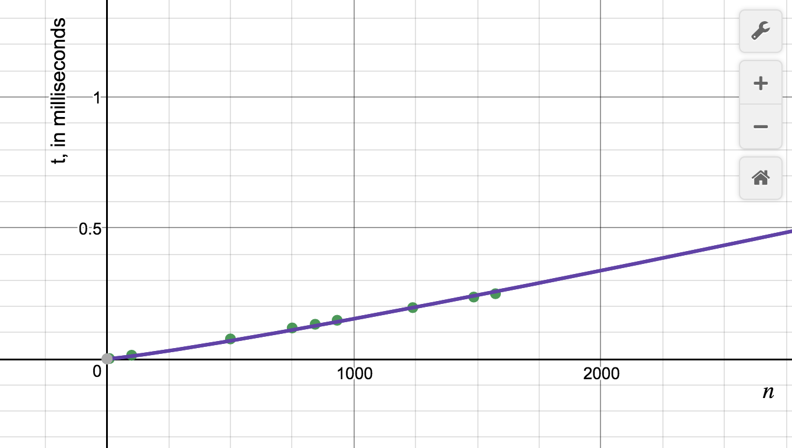
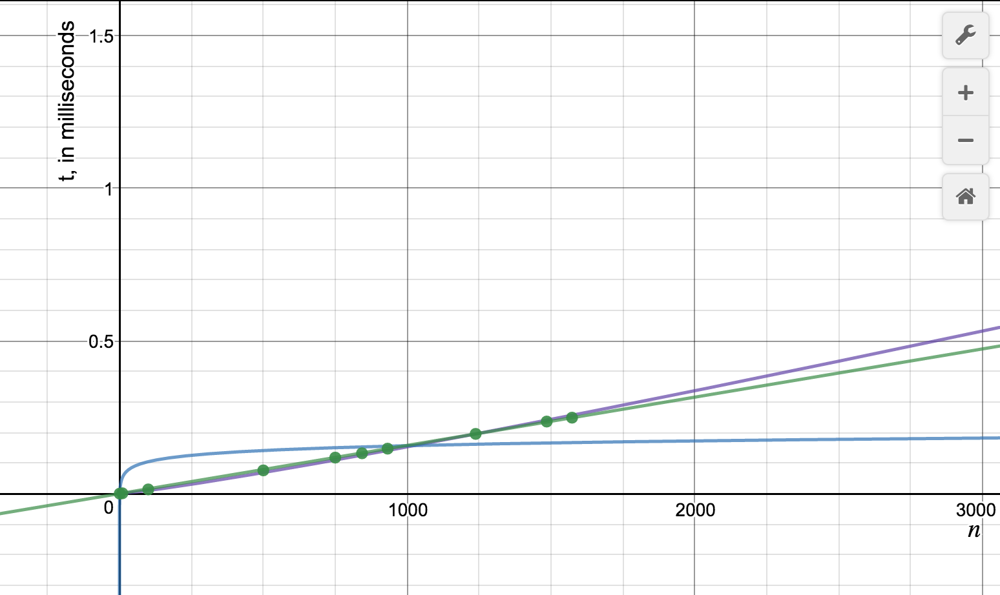

# AACK
Angela Kim, Alison Lee, Kevin Li

<h2> MERGE SORT ALGORITHM: </h2>

 This algorithm starts on the basic idea that a single card is sorted with itself. It takes a deck and divides it repeatedly in half until each subdivision is one card long. Then, there is a merge method that takes two sorted lists and puts them together. The merge method is used to recursively put the subdivisions of the deck back together.

<h2> HOW TO RUN IT: </h2>
<ol> 
<li> Clone the repository </li>
<li> In terminal, run <code>javac MergeSortTester.java</code> </li>
<li> run <code>java MergeSortTester</code> for each tiem you would like to have a trial</li>
</ol>

<h2> BIG OH HYPOTHESIS: </h2>

 O(nlogn): Since the recursive aspect of the mergesort algo splits the dataset in two every time, the runtime would be logn. (Essentially (½)^(# of divisions)) However, since the sort method also calls the merge method, and the merge method runs through each dataset linearly, the total runtime would be O(nlogn). 

<h2> DATA AND ANALYSIS: </h2>
  

 This data represents an average of 1000 trials of the given n values. The times are represented in milliseconds. 

 The data is plotted here, using <a href="https://www.desmos.com/calculator"> Desmos </a>. 

<h3> Linear Regression: </h3>

<h3> Quadratic Regression: </h3>

<h3> Logarithmic Regression: </h3>

<h3> LogLinear Regression: </h3>

<h3> Combined Graph </h3>

 The 3 more likely regressions were plotted onto the points, and it seemed that the linear and loglinear regressions most closely fit the data. For the specific data points used, it seems that a <b> O(n) </b> seems most appropriate. However, the experiment may also produce more interesting or different results given more than 1000 trials, and more experimentation for even larger values of n. 

